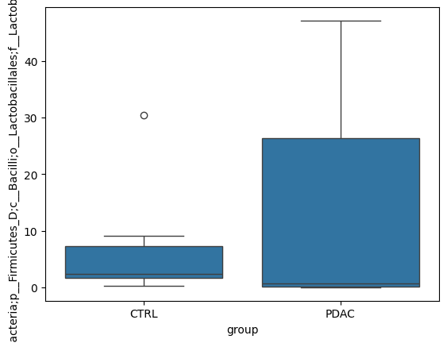
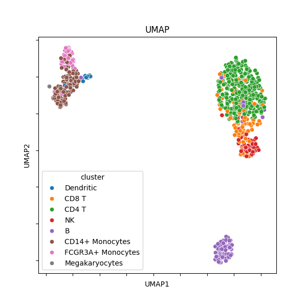

# SeikaWakate-AI
2024年九州支部主催、「話題のAIツールで生化学を遊び倒せ！」用のリポジトリ

---

2024/07/15<br>
この度はご参加頂き、ありがとうございました。<br>
[examples](https://github.com/Yokohide0317/SeikaWakate-AI/tree/main/examples)に解析例を置きました。<br>
ご参考にして、今後の研究などに活かして頂けると大変幸いでございます。

---

# ChatGPTを活用！Pythonでデータ解析

## 説明 & Google Colaboratoryの使い方
[ChatGPT企画_説明スライド.pdf](https://github.com/Yokohide0317/SeikaWakate-AI/blob/main/slides/ChatGPT%E4%BC%81%E7%94%BB_%E8%AA%AC%E6%98%8E%E3%82%B9%E3%83%A9%E3%82%A4%E3%83%89.pdf)

## 1. bulk RNA-Seq

| File | Description |
|:---:|:---:|
| [bulkRNASeq_TPM-prep-HT.csv](https://github.com/Yokohide0317/SeikaWakate-AI/blob/main/data/bulkRNASeq_TPM-prep-HT.csv) | HT-29(ヒト大腸がん細胞株)遺伝子発現解析 |

- GSE: ブドウ種子エキス
- OPC: オリゴメリック・プロアントシアニジン


### 手順（例）
| No. | 手順 | キーワード |
| :---: | --- | --- |
| 1 | データの読み込み | `pandas` |
| 2 | グループ列の追加 |  |
| 3 | `TGFB3`を棒グラフに | `matplotlib`, `seaborn` |
| 4 | 3をカスタマイズ |  |

<details>
<summary>ChatGPTへの指示例</summary>

1. データの読み込み
```
# 前提
あなたは優秀なアシスタントです。
私は生物学者で、Python初心者です。細かく教えて下さい。

# やりたいこと
Google Colaboratoryでcsvを読み込みたいです。
`/contents/bulkRNASeq_TPM-prep-HT.csv`にアップロードしました。
一番左の列をindexとして、読み込む方法を教えて下さい。
```

2. グループ列の追加
```
# やりたいこと
読み込んだら、以下のようなデータになっていました。
Groupという行に、HT-C、HT-C、HT-OPC、HT-OPC、HT-GSE、 HT-GSE を入れたいです。

# データ
	SFN	CDKN1A	MAD1L1	CCNE2	E2F1	TGFB3
HT-C1	109.9	15.99	11.98	6.862	39.31	2.1440
HT-C2	136.3	20.81	13.08	7.282	44.13	1.3610
HT-OPC1	186.6	53.71	14.21	6.255	40.06	1.2950
HT-OPC2	175.7	46.12	12.13	6.907	38.95	0.8241
HT-GSE1	193.5	45.99	10.92	4.911	28.10	1.0750
HT-GSE2	194.7	55.96	11.76	4.427	30.49	0.6942
---

```

3. `TGFB3`を棒グラフに
```
先程のデータを棒グラフで可視化したいです。
TGFB3行ｙ軸に、Group行ｘ軸に使用してください。
```

4. 3をカスタマイズ
```
先程の棒グラフを次のようにカスタマイズしてください。
・描写範囲を縦長に
・色を、HT-Cは灰色、HT-OPCが緑、HT-GSEが赤
・エラーバーを追加
・グラフのタイトルを追加
・y軸のラベルを変更
```


</details>

<details>
<summary>画像</summary>

②後


③後


④後


</details>

<details>
<summary>Cite</summary>
```
Ravindranathan P, Pasham D, Balaji U, Cardenas J, Gu J, Toden S, Goel A. Mechanistic insights into anticancer properties of oligomeric proanthocyanidins from grape seeds in colorectal cancer. Carcinogenesis. 2018 May 28;39(6):767-777. doi: 10.1093/carcin/bgy034. PMID: 29684110; PMCID: PMC5972632.
```
</details>

---

## 2. Microbiome

| File | Description |
|:---:|:---:|
| [microbiome_level5_counts.csv](https://github.com/Yokohide0317/SeikaWakate-AI/blob/main/data/microbiome_level5_counts.csv) | 膵臓がん患者の腸内細菌叢データ |

- PDAC: 膵管腺癌(Pancreatic Ductal Adenocarcinoma)
- CTRL: コントロール

### 手順（例）

| No. | 手順 | キーワード |
| :---: | --- | --- |
| 1 | データの読み込み。最初の列をindex列とする。 | `pandas` |
| 2 | サンプル行ごとに百分率化 | 合計値を`100`に揃える |
| 3 | index列を元に、group列を追加 (例: `CTRL_feces_028`->`CTRL`) |  |
| 4 | `d__Bacteria;p__Firmicutes_D;c__Bacilli;o__Lactobacillales;f__Lactobacillaceae`列<br>を箱ひげ図に | `matplotlib`, `seaborn` |
| 5 | 積み上げ棒グラフで、各サンプル行の組成を可視化(超難問) |  |

<details>
<summary>画像</summary>

②後


④後


⑤後


</details>

<details>
<summary>ChatGPTへの指示例</summary>

1. データの読み込み
```
# 前提
あなたは優秀なアシスタントです。
私は生物学者で、Python初心者です。細かく教えて下さい。

# やりたいこと
Google Colaboratoryでcsvを読み込みたいです。
`/contents/microbiome_level5_counts.csv`にアップロードしました。
一番左の列をindexとして、読み込む方法を教えて下さい。
```

2. サンプル行ごとに百分率化
```
# やりたいこと
読み込んだら、以下のようなデータになっていました。
サンプルごとに百分率化したいです。コードを教えて下さい。

# データ
	d__Bacteria;p__Campylobacterota;c__Campylobacteria;o__Campylobacterales;f__Campylobacteraceae	d__Bacteria;p__Proteobacteria;c__Gammaproteobacteria;o__Enterobacterales_A_737866;f__Succinivibrionaceae	
CTRL_feces_028	5	1
CTRL_feces_099	4	0
CTRL_feces_100	0	1
PDAC_feces_001	0	0
PDAC_feces_002	0	1
PDAC_feces_003	0	1
---

```

3. index列を元に、group列を追加 (例: `CTRL_feces_028`->`CTRL`)
```
先程のデータにgroup列を追加したいです。
index列を元に、group列を追加してください。 (例: `CTRL_feces_028`->`CTRL`)
```

4. `d__Bacteria;p__Firmicutes_D;c__Bacilli;o__Lactobacillales;f__Lactobacillaceae`列を箱ひげ図に
```
先程のデータの`d__Bacteria;p__Firmicutes_D;c__Bacilli;o__Lactobacillales;f__Lactobacillaceae`列を<br>箱ひげ図にしてください。
```


</details>

<details>
<summary>Cite</summary>
Nagata N, Nishijima S, Kojima Y, Hisada Y, Imbe K, Miyoshi-Akiyama T, Suda W, Kimura M, Aoki R, Sekine K, Ohsugi M, Miki K, Osawa T, Ueki K, Oka S, Mizokami M, Kartal E, Schmidt TSB, Molina-Montes E, Estudillo L, Malats N, Trebicka J, Kersting S, Langheinrich M, Bork P, Uemura N, Itoi T, Kawai T. Metagenomic Identification of Microbial Signatures Predicting Pancreatic Cancer From a Multinational Study. Gastroenterology. 2022 Jul;163(1):222-238. doi: 10.1053/j.gastro.2022.03.054. Epub 2022 Apr 8. PMID: 35398347.
</details>

---

## 3. single cell RNA-Seq
| File | Description |
|:---:|:---:|
| [scRNASeq_counts_pbmc_preped.csv](https://github.com/Yokohide0317/SeikaWakate-AI/blob/main/data/scRNASeq_counts_pbmc_preped.csv) | 末梢血のシングルセルごとのカウントデータ |
| [scRNASeq_cluster_pbmc_preped.csv](https://github.com/Yokohide0317/SeikaWakate-AI/blob/main/data/scRNASeq_cluster_pbmc_preped.csv) | `scRNASeq_counts_pbmc_preped.csv`の細胞種アノテーション |

### 手順（例）

| No. | 手順 | キーワード |
| :---: | --- | --- |
| 1 | データの読み込みx2 | `pandas` |
| 2 | Cellごとに発現量を全マッピング数で補正 | CPM補正(10の6乗) |
| 3 | `log1p`で対数変換 | `numpy` |
| 4 | UMAPで次元削除 & 細胞種データと結合 | `umap` |
| 5 | UMAP結果を散布図で可視化 | `matplotlib`, `seaborn` |
| 6 | t-SNEで次元削除 & 細胞種データと結合 | `sklearn` |
| 7 | t-SNE結果を散布図で可視化 | `matplotlib`, `seaborn` |
| 8 | 細胞種ごとに`IL7R`の発現量を`violinplot`で可視化 | `seaborn` |

<details>
<summary>画像</summary>

③後


⑤後


⑦後


⑧後


</details>

<details>
<summary>ChatGPTへの指示例</summary>

1. データの読み込みx2
```
# 前提
あなたは優秀なアシスタントです。
私は生物学者で、Python初心者です。細かく教えて下さい。

# やりたいこと
Google Colaboratoryでcsvを読み込みたいです。
`/contents/scRNASeq_counts_pbmc_preped.csv`
と
`/contents/scRNASeq_cluster_pbmc_preped.csv`
にアップロードしました。
それぞれ、`counts`、`cluster`という名前の変数に、
一番左の列をindexとして、読み込む方法を教えて下さい。
```

2. Cellごとに発現量を全マッピング数で補正
```
# やりたいこと
先ほど読み込んだデータは、single cell RNA-Seq解析のカウントデータです。
補正されていないので、「Cellごとに発現量を全マッピング数で補正」する必要があるようです。
データは以下の通りです。やり方を教えて下さい。

# データ（例）
CellID	Gene1	Gene2	Gene3	...
AGATGA-1	1	20	5	...
AGATGG-1	4	10	4	...
...

```


</details>

<details>
<summary>Cite</summary>
- Satija, R., Farrell, J., Gennert, D. et al. Spatial reconstruction of single-cell gene expression data. Nat Biotechnol 33, 495–502 (2015). https://doi.org/10.1038/nbt.3192

- [Preprocessing and clustering 3k PBMCs](https://scanpy-tutorials.readthedocs.io/en/latest/pbmc3k.html)
</details>


